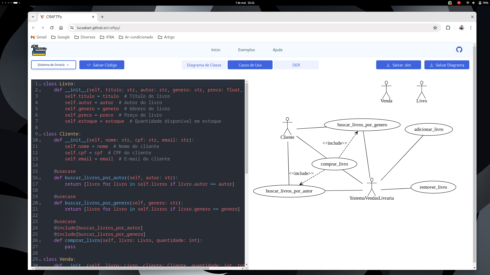

<h1 align="center">
  <br>
  <a href="https://lucaskart.github.io/craftpy/"></a>
  <br>
  CRAFTPy
  <br>
</h1>

<h4 align="center">A Tool for Visually Impaired Students to Build UML Diagrams from Python Coding.</h4>

<p align="center">
  <a href="#description">Description</a> •
  <a href="#demo">Demo</a> •
  <a href="#credits">Credits</a> •
  <a href="#development">Development</a> •
  <a href="#team">Team</a> •
  <a href="#license">License</a>
</p>

<h1 align="center">
  <br>
  <a href="https://lucaskart.github.io/craftpy/"></a>
</h1>

## Description
The CRAFTPy tool assists blind and visually impaired ICT students in building diagrams through the Python programming language. CRAFTPy allows users to create class diagrams, use case diagrams, and entity-relationship diagrams, commonly seen in software engineering and database courses in universities.

## Demo
Here is a working live demo :  https://lucaskart.github.io/craftpy/

## Credits

This software uses the following open source packages:

- [Node.js](https://nodejs.org/)
- [CodeMirror](http://codemirror.net/)
- [Vite](https://vitejs.dev/) + [React](https://react.dev/) + [Typescript](https://www.typescriptlang.org/)
- [TailwindCSS](https://tailwindcss.com/)
- [Radix UI](https://www.radix-ui.com/)
- [D3 Graphviz](https://github.com/magjac/d3-graphviz)

## Development

### Mandatory dependencies
- [NodeJS](https://nodejs.org/)

### Getting Started

#### Download the code

```bash
git clone https://github.com/Lucaskart/craftpy.git
cd craftpy
```

#### Downloading and installing packages 
```bash
npm install
# or
yarn install
```

#### Run the development server:

```bash
npm run dev
# or
yarn dev
```

## Learn More
- [https://vitejs.dev/guide/](https://vitejs.dev/guide/)

 
## Team
<table align="center">
    <tbody>
        <td align="center" valign="top" width="14.28%"><a href=""><br /><sub><b>Larissa Rocha</b></sub></a></td>
        <td align="center" valign="top" width="14.28%"><a href=""><br /><sub><b>Lucas Lopes</b></sub></a></td>
        <td align="center" valign="top" width="14.28%"><a href="https://rtosta.com"><br /><sub><b>Rafael Tosta</b></sub></a></td>
    </tbody>
</table>

## License

[GNU General Public License v3.0](LICENSE)